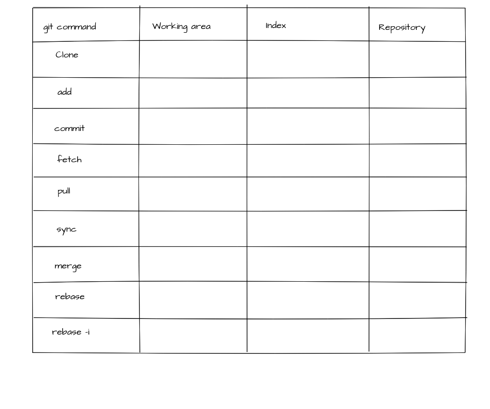

# Table of contents
   * [The Core](#the-core)
      * [Blob Object](#blob-object)
   * [The First Commit](#the-first-commit)
      * [The object database (FIG 1)](#the-object-database-fig-1)
      * [Tree Object](#tree-object)
      * [Commit Object](#commit-object)
      * [Branch](#branch)
      * [Head](#head)
      * [The 4 main parts of git](#the-4-main-parts-of-git)
      * [Merging](#merging)

Git is a distributed version control system. 

#  The Core
At it's core git is a simple key-value data store. A persisted map. 

```bash
$ echo "Hello World" | git hash-object --stdin
557db03de997c86a4a028e1ebd3a1ceb225be238
```
The above command `git hash-object` takes any content (eg string, file, etc) in this case `Hello World` and produces a corresponding key. It uses a SHA1 hashing algorithm to produce this key ie. its content hash. 

| Key                                       | Value         |
| ----------------------------------------- | ------------- | 
| 557db03de997c86a4a028e1ebd3a1ceb225be238  | Hello World |  

> This key-value is the building block of git and is called an **object**.

> There are four types of objects in git **blob**, **commit**, **tree** and **annotated tag**.

## Blob Object
A simple `-w` switch to the `git hash-object` will persist the key-value pair to git's internal object database.

```bash
$ mkdir hello-git
$ cd hello-git
$ git init
Initialized empty Git repository in /Users/chinkitpatel/Dev/hello-git/.git/
$ echo "Hello World" | git hash-object --stdin -w
```
Let's inspect the internal git object database. 

```bash
$ tree -a
.
└── .git
    ├── HEAD
    ├── config
    ├── description
    ├── hooks
    │   ├── applypatch-msg.sample
    │   ├── commit-msg.sample
    │   ├── post-update.sample
    │   ├── pre-applypatch.sample
    │   ├── pre-commit.sample
    │   ├── pre-push.sample
    │   ├── pre-rebase.sample
    │   ├── pre-receive.sample
    │   ├── prepare-commit-msg.sample
    │   └── update.sample
    ├── info
    │   └── exclude
    ├── objects
    │   ├── 55
    │   │   └── 7db03de997c86a4a028e1ebd3a1ceb225be238
    │   ├── info
    │   └── pack
    └── refs
        ├── heads
        └── tags

10 directories, 15 files
```

Note the contents of the **objects** folder. The folder `55` is the first two characters of the hash and the file name is the remaining hash value of the content *Hello World*.

Let's inspect the content of the `7db03de997c86a4a028e1ebd3a1ceb225be238` file.

```bash 
$ cat .git/objects/55/7db03de997c86a4a028e1ebd3a1ceb225be238
xK??OR04b?H????/?I?A?
```
Git does internal optimization therefore the content is not human readable. To inspect the content run the below. 

```bash 
$ git cat-file 557db03de997c86a4a028e1ebd3a1ceb225be238 -p
Hello World
```
> A Git blob  is the object type used to store the contents of each file in the repository. 

```bash
$ git cat-file 557db03de997c86a4a028e1ebd3a1ceb225be238 -t
blob
```
# The First Commit

```bash
# If you are following along start with a new directory. Not within the hello-git you created above.
$ mkdir banks
$ cd banks
$ git init
Initialized empty Git repository in /Users/chinkitpatel/Dev/banks/.git/
$ echo "ANZ" > banks.txt
$ echo "NAB" >> banks.txt
$ mkdir list
$ echo "Website: http://www.anz.com.au" > list/anz.txt
$ echo "Website: http://www.nab.com.au" > list/nab.txt
```

The directories and files we just added are not being tracked by git.

```bash
$ git status
On branch master

No commits yet

Untracked files:
  (use "git add <file>..." to include in what will be committed)

	banks.txt
	list/

nothing added to commit but untracked files present (use "git add" to track)
$ git add .
$ git status
On branch master

No commits yet

Changes to be committed:
  (use "git rm --cached <file>..." to unstage)

	new file:   banks.txt
	new file:   list/anz.txt
$ git commit -m "first commit"
  [master (root-commit) 50a6b98] first commit
  3 files changed, 4 insertions(+)
  create mode 100644 banks.txt
  create mode 100644 list/anz.txt
  create mode 100644 list/nab.txt
  Reading package lists... Done
  Building dependency tree
  Reading state information... Done

$ tree -a
.
├── banks.txt
├── .git
│   ├── branches
│   ├── COMMIT_EDITMSG
│   ├── config
│   ├── description
│   ├── HEAD
│   ├── hooks
│   │   ├── applypatch-msg.sample
│   │   ├── commit-msg.sample
│   │   ├── post-update.sample
│   │   ├── pre-applypatch.sample
│   │   ├── pre-commit.sample
│   │   ├── prepare-commit-msg.sample
│   │   ├── pre-push.sample
│   │   ├── pre-rebase.sample
│   │   └── update.sample
│   ├── index
│   ├── info
│   │   └── exclude
│   ├── logs
│   │   ├── HEAD
│   │   └── refs
│   │       └── heads
│   │           └── master
│   ├── objects
│   │   ├── 50
│   │   │   └── a6b985541e31c80f99efe7d597e719ad5e46de
│   │   ├── 5b
│   │   │   └── 68a6c2bfdeb38964cdf760c6148a05926c161e
│   │   ├── 6e
│   │   │   └── 4672d0ffc3a2dc6025f77be46239e1a505046e
│   │   ├── b3
│   │   │   └── 92c2e24ac523582e4b332b19c2f1345e44dc9d
│   │   ├── f8
│   │   │   └── d24db536e3a943fb8a2f755a594fef1d9ad299
│   │   ├── f9
│   │   │   └── 635f900490663d63e3ff55958e49b7c66389bf
│   │   ├── info
│   │   └── pack
│   └── refs
│       ├── heads
│       │   └── master
│       └── tags
└── list
    ├── anz.txt
    └── nab.txt

20 directories, 27 files

```
### The object database (FIG 1)


```bash
$ git cat-file -p 50a6
tree 5b68a6c2bfdeb38964cdf760c6148a05926c161e
author Brian Matindi <brianmatindi12@gmail.com> 1525314405 +0930
committer Brian Matindi <brianmatindi12@gmail.com> 1525314405 +0930

first commit

$ git cat-file -p 5b68
100644 blob 6e4672d0ffc3a2dc6025f77be46239e1a505046e    banks.txt
040000 tree b392c2e24ac523582e4b332b19c2f1345e44dc9d    list

$ git cat-file -p 6e46
ANZ
NAB

$ git cat-file -p b392
100644 blob f9635f900490663d63e3ff55958e49b7c66389bf    anz.txt
100644 blob f8d24db536e3a943fb8a2f755a594fef1d9ad299    nab.txt

$ git cat-file -p f8d2
Website: http://www.nab.com.au

$ git cat-file -p f963
Website: http://www.anz.com.au

```
## Tree Object 
- All the content in git is stored as tree or blob objects.
- A tree is a directory stored in git while the blob is the content eg.file or text stored in the directory(tree).
- It can be considered an equivalent to a directory on your system.
- As seen in the image above, our first commit points at the root directory of the project(our 1st tree)
- As on the `fig1` above, there are 2 trees : 
  - The 1st tree object is that of the root directory. : `5b68`
  - The 2nd tree is that of the list directory :  `b392`
-  A single tree object contains one or more tree entries, each of which contains a SHA-1 pointer to a blob or subtree with its associated mode(eg.file permissions), type, and filename.
```bash
$  git cat-file -p master^{tree}
100644 blob 6e4672d0ffc3a2dc6025f77be46239e1a505046e    banks.txt
040000 tree b392c2e24ac523582e4b332b19c2f1345e44dc9d    list
```
## Commit Object 
- A commit object stores information about who saved the current state of our repository, when they saved this, or why they saved this. 
- We can test this by viewing the contents of one of our commits i.e the initial commit.
```bash
$  git cat-file -p 50a6
tree 5b68a6c2bfdeb38964cdf760c6148a05926c161e
author Brian Matindi <brianmatindi12@gmail.com> 1525314405 +0930
committer Brian Matindi <brianmatindi12@gmail.com> 1525314405 +0930

initial commit
```
- As seen above, the first commit contains : 
  - A pointer to one of our trees i.e the root directory of the project.
  - Information about the author of the changes made.
  - The commit message. 

## Branch 
- A branch is a pointer to a commit.
```bash
$  tree .git/refs/heads/ 
.git/refs/heads/
├── development
└── master

0 directories, 2 files
$ cat .git/refs/heads/master
50a6b985541e31c80f99efe7d597e719ad5e46de
```
 - The output of the last command is a hash. `50a6b985541e31c80f99efe7d597e719ad5e46de` is a commit. 
 - A look at FIG 1 proves this to be correct. `50a6b985541e31c80f99efe7d597e719ad5e46de` is our initial commit.

## Head
- Since we can have many branches in a project, the only way to keep track of what branch we're currently on is the Head. 
- We can have only 1 head & it is the pointer to the current branch.

```bash
$ cat .git/HEAD
ref: refs/heads/master
```

## The 4 main parts of git
A git project stores information in four areas : 
1. Repository - this is basically like your git repo’s database.
2. Index - The staging area/index is a file, generally contained in your Git directory, that stores information about what will go into your next commit. Its technical name in Git parlance is the “index”, but the phrase “staging area” works just as well.
3. Working area - This is the directory where all your project files and folders reside (along with the .git folder). Each of your files within this directory is in 1 of possible states, untracked, unmodified, modified, staged.
4. Stash


To understand how most of the git commands you'll use work, you'll have to ask yourself the following two questions : 
1. How does the command move data around the 4 areas.
2. What does the command do to the repository area.



## Merging
After you have finished implementing a new feature on a branch eg. the development branch we created earlier or some other branch you have, you want to bring that new feature into the main branch, so that everyone can use it. You can do so with the git merge or git pull command.
The syntax for the commands is as follows:
```bash
#we currently have two branches. The one we're working on at the moment is the master branch. Let's create a new branch called the testing branch.
$ git branch testing
$ git checkout testing
Switched to branch 'testing'
$ echo "bank test" >> banks.txt
# we have now modified the banks.txt file so let's commit the change we just made.
$ git add .
$ git commit -m"new test branch commit"
[testing 5735525] new test branch commit
 1 file changed, 1 insertion(+)
```
 - Our testing branch is now one commit ahead of the master branch. So what if we wanted to bring the two branches to the same level. ie. Have all the changes we just made on the testing branch implemented on the master branch too?
 - We do this by running the following commands : 
 ```bash
 $ git checkout master
Switched to branch 'master'
 # if we try to view the contents of the banks.txt folder, you'll notice that the most recent line we added isn't present. This is because the line was added to the testing # # # branch of our project. We're currently in the master. 
 $ cat banks.txt
ANZ
NAB
AMP
# To copy the changes we made while in the testing branch on the master branch,
 # we first have to switch to the master branch
$ git merge testing
Updating 9693f04..5735525
Fast-forward
 banks.txt | 1 +
 1 file changed, 1 insertion(+)
 $ cat banks.txt
ANZ
NAB
AMP
bank test
# both the master and testing branches are now synced and exactly the same.
 ```
 - NB : Git can get very confused if there are uncommitted changes in the files when you ask it to perform a merge. So make sure to commit whatever changes you have made so far before you merge.
 - A conflict arises if the commit to be merged in has a change in one place, and the current commit has a change in the same place. Git has no way of telling which change should take precedence.
 - To resolve the commit, edit the files to fix the conflicting changes. Then run git add to add the resolved files, and run git commit to commit the repaired merge. Git remembers that you were in the middle of a merge, so it sets the parents of the commit correctly.

References
- https://git-scm.com/book/en/v2/Git-Internals-Git-Objects
- https://www.mockflow.com
