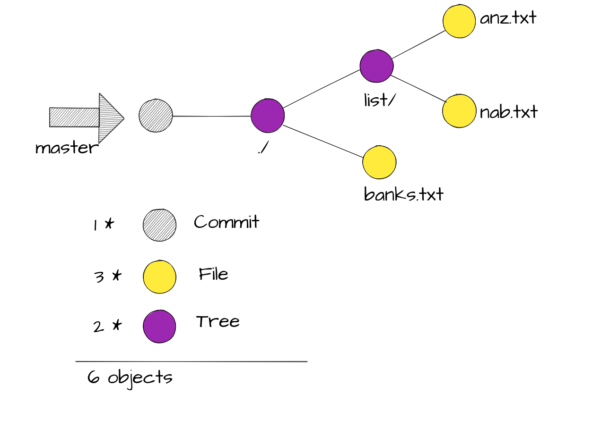

Git is a distributed version control system. 

#  The Core
At it's core git is a simple key-value data store. A persisted map. 

```bash
$ echo "Hello World" | git hash-object --stdin
557db03de997c86a4a028e1ebd3a1ceb225be238
```
The above command `git hash-object` takes any content (eg string, file, etc) in this case `Hello World` and produces a corresponding key. It uses a SHA1 hashing algorithm to produce this key ie. its content hash. 

| Key                                       | Value         |
| ----------------------------------------- | ------------- | 
| 557db03de997c86a4a028e1ebd3a1ceb225be238  | Hello World |  

> This key-value is the building block of git and is called an **object**.

> There are four types of objects in git **blob**, **commit**, **tree** and **annotated tag**.

## Blob Object
A simple `-w` switch to the `git hash-object` can write it to the internal object database.

```bash
$ mkdir hello-git
$ cd hello-git
$ git init
Initialized empty Git repository in /Users/chinkitpatel/Dev/hello-git/.git/
$ echo "Hello World" | git hash-object --stdin -w
```
Let's inspect the internal git object database. 

```bash
$ tree -a
.
└── .git
    ├── HEAD
    ├── config
    ├── description
    ├── hooks
    │   ├── applypatch-msg.sample
    │   ├── commit-msg.sample
    │   ├── post-update.sample
    │   ├── pre-applypatch.sample
    │   ├── pre-commit.sample
    │   ├── pre-push.sample
    │   ├── pre-rebase.sample
    │   ├── pre-receive.sample
    │   ├── prepare-commit-msg.sample
    │   └── update.sample
    ├── info
    │   └── exclude
    ├── objects
    │   ├── 55
    │   │   └── 7db03de997c86a4a028e1ebd3a1ceb225be238
    │   ├── info
    │   └── pack
    └── refs
        ├── heads
        └── tags

10 directories, 15 files
```

Note the contents of the **objects** folder. The folder `55` is the first two characters of the hash and the file name is the remaining hash value of the content *Hello World*.

Let's inspect the content of the `7db03de997c86a4a028e1ebd3a1ceb225be238` file.

```bash 
$ cat .git/objects/55/7db03de997c86a4a028e1ebd3a1ceb225be238
xK??OR04b?H????/?I?A?
```
Git does internal optimization therefore the content is not human readable. To inspect the content run the below. 

```bash 
$ git cat-file 557db03de997c86a4a028e1ebd3a1ceb225be238 -p
Hello World
```
> A Git blob  is the object type used to store the contents of each file in the repository. 

```bash
$ git cat-file 557db03de997c86a4a028e1ebd3a1ceb225be238 -t
blob
```
# The First Commit

```bash
# If you are following along start with a new directory. Not within the hello-git you created above.
$ mkdir banks
$ cd banks
$ git init
Initialized empty Git repository in /Users/chinkitpatel/Dev/banks/.git/
$ echo "ANZ" > banks.txt
$ echo "NAB" >> banks.txt
$ mkdir list
$ echo "Website: http://www.anz.com.au" > list/anz.txt
$ echo "Website: http://www.nab.com.au" > list/nab.txt
```

The directories and files we just added are not being tracked by git.

```bash
#This needs to be redone..
$ git status
On branch master

No commits yet

Untracked files:
  (use "git add <file>..." to include in what will be committed)

	banks.txt
	list/

nothing added to commit but untracked files present (use "git add" to track)
$ git add .
$ git status
On branch master

No commits yet

Changes to be committed:
  (use "git rm --cached <file>..." to unstage)

	new file:   banks.txt
	new file:   list/anz.txt
$ git commit -m "initial commit"
  [master (root-commit) 50a6b98] initial commit
  3 files changed, 4 insertions(+)
  create mode 100644 banks.txt
  create mode 100644 list/anz.txt
  create mode 100644 list/nab.txt
  Reading package lists... Done
  Building dependency tree
  Reading state information... Done

$ tree -a
.
├── banks.txt
├── .git
│   ├── branches
│   ├── COMMIT_EDITMSG
│   ├── config
│   ├── description
│   ├── HEAD
│   ├── hooks
│   │   ├── applypatch-msg.sample
│   │   ├── commit-msg.sample
│   │   ├── post-update.sample
│   │   ├── pre-applypatch.sample
│   │   ├── pre-commit.sample
│   │   ├── prepare-commit-msg.sample
│   │   ├── pre-push.sample
│   │   ├── pre-rebase.sample
│   │   └── update.sample
│   ├── index
│   ├── info
│   │   └── exclude
│   ├── logs
│   │   ├── HEAD
│   │   └── refs
│   │       └── heads
│   │           └── master
│   ├── objects
│   │   ├── 50
│   │   │   └── a6b985541e31c80f99efe7d597e719ad5e46de
│   │   ├── 5b
│   │   │   └── 68a6c2bfdeb38964cdf760c6148a05926c161e
│   │   ├── 6e
│   │   │   └── 4672d0ffc3a2dc6025f77be46239e1a505046e
│   │   ├── b3
│   │   │   └── 92c2e24ac523582e4b332b19c2f1345e44dc9d
│   │   ├── f8
│   │   │   └── d24db536e3a943fb8a2f755a594fef1d9ad299
│   │   ├── f9
│   │   │   └── 635f900490663d63e3ff55958e49b7c66389bf
│   │   ├── info
│   │   └── pack
│   └── refs
│       ├── heads
│       │   └── master
│       └── tags
└── list
    ├── anz.txt
    └── nab.txt

20 directories, 27 files

```

## Tree Object 

- A tree is a directory stored in git.
- As seen in the image above, our first commit points at the root directory of the project(our 1st tree)

## Commit Object 

## Branch 

## Head

We can have only 1 head & it is the pointer to the current commit...?
Is head a pointer to the branch or a commit.

References
- https://git-scm.com/book/en/v2/Git-Internals-Git-Objects
- https://www.mockflow.com