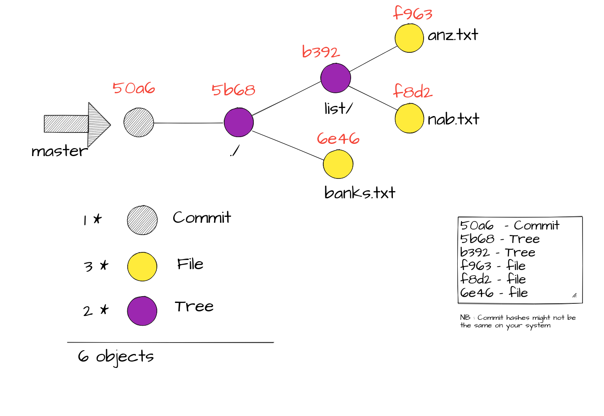
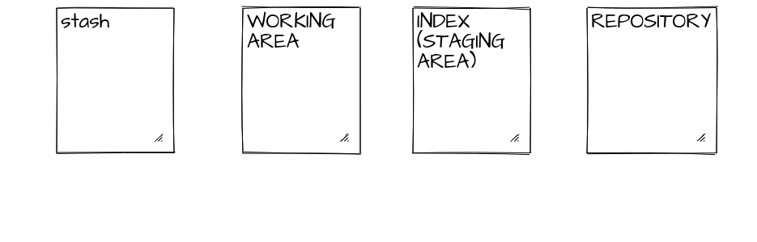
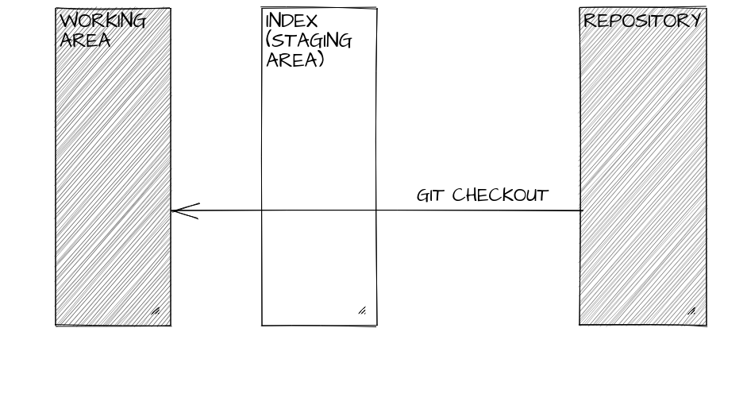
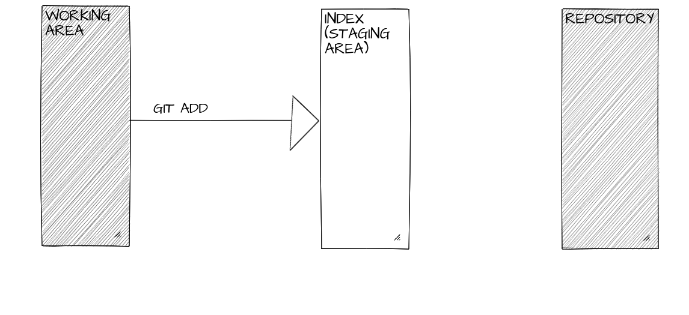
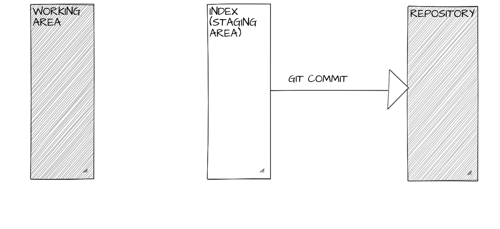

Git is a distributed version control system. 

#  The Core
At it's core git is a simple key-value data store. A persisted map. 

```bash
$ echo "Hello World" | git hash-object --stdin
557db03de997c86a4a028e1ebd3a1ceb225be238
```
The above command `git hash-object` takes any content (eg string, file, etc) in this case `Hello World` and produces a corresponding key. It uses a SHA1 hashing algorithm to produce this key ie. its content hash. 

| Key                                       | Value         |
| ----------------------------------------- | ------------- | 
| 557db03de997c86a4a028e1ebd3a1ceb225be238  | Hello World |  

> This key-value is the building block of git and is called an **object**.

> There are four types of objects in git **blob**, **commit**, **tree** and **annotated tag**.

## Blob Object
A simple `-w` switch to the `git hash-object` can write it to the internal object database.

```bash
$ mkdir hello-git
$ cd hello-git
$ git init
Initialized empty Git repository in /Users/chinkitpatel/Dev/hello-git/.git/
$ echo "Hello World" | git hash-object --stdin -w
```
Let's inspect the internal git object database. 

```bash
$ tree -a
.
└── .git
    ├── HEAD
    ├── config
    ├── description
    ├── hooks
    │   ├── applypatch-msg.sample
    │   ├── commit-msg.sample
    │   ├── post-update.sample
    │   ├── pre-applypatch.sample
    │   ├── pre-commit.sample
    │   ├── pre-push.sample
    │   ├── pre-rebase.sample
    │   ├── pre-receive.sample
    │   ├── prepare-commit-msg.sample
    │   └── update.sample
    ├── info
    │   └── exclude
    ├── objects
    │   ├── 55
    │   │   └── 7db03de997c86a4a028e1ebd3a1ceb225be238
    │   ├── info
    │   └── pack
    └── refs
        ├── heads
        └── tags

10 directories, 15 files
```

Note the contents of the **objects** folder. The folder `55` is the first two characters of the hash and the file name is the remaining hash value of the content *Hello World*.

Let's inspect the content of the `7db03de997c86a4a028e1ebd3a1ceb225be238` file.

```bash 
$ cat .git/objects/55/7db03de997c86a4a028e1ebd3a1ceb225be238
xK??OR04b?H????/?I?A?
```
Git does internal optimization therefore the content is not human readable. To inspect the content run the below. 

```bash 
$ git cat-file 557db03de997c86a4a028e1ebd3a1ceb225be238 -p
Hello World
```
> A Git blob  is the object type used to store the contents of each file in the repository. 

```bash
$ git cat-file 557db03de997c86a4a028e1ebd3a1ceb225be238 -t
blob
```
# The First Commit

```bash
# If you are following along start with a new directory. Not within the hello-git you created above.
$ mkdir banks
$ cd banks
$ git init
Initialized empty Git repository in /Users/chinkitpatel/Dev/banks/.git/
$ echo "ANZ" > banks.txt
$ echo "NAB" >> banks.txt
$ mkdir list
$ echo "Website: http://www.anz.com.au" > list/anz.txt
$ echo "Website: http://www.nab.com.au" > list/nab.txt
```

The directories and files we just added are not being tracked by git.

```bash
$ git status
On branch master

No commits yet

Untracked files:
  (use "git add <file>..." to include in what will be committed)

	banks.txt
	list/

nothing added to commit but untracked files present (use "git add" to track)
$ git add .
$ git status
On branch master

No commits yet

Changes to be committed:
  (use "git rm --cached <file>..." to unstage)

	new file:   banks.txt
	new file:   list/anz.txt
$ git commit -m "initial commit"
  [master (root-commit) 50a6b98] initial commit
  3 files changed, 4 insertions(+)
  create mode 100644 banks.txt
  create mode 100644 list/anz.txt
  create mode 100644 list/nab.txt
  Reading package lists... Done
  Building dependency tree
  Reading state information... Done

$ tree -a
.
├── banks.txt
├── .git
│   ├── branches
│   ├── COMMIT_EDITMSG
│   ├── config
│   ├── description
│   ├── HEAD
│   ├── hooks
│   │   ├── applypatch-msg.sample
│   │   ├── commit-msg.sample
│   │   ├── post-update.sample
│   │   ├── pre-applypatch.sample
│   │   ├── pre-commit.sample
│   │   ├── prepare-commit-msg.sample
│   │   ├── pre-push.sample
│   │   ├── pre-rebase.sample
│   │   └── update.sample
│   ├── index
│   ├── info
│   │   └── exclude
│   ├── logs
│   │   ├── HEAD
│   │   └── refs
│   │       └── heads
│   │           └── master
│   ├── objects
│   │   ├── 50
│   │   │   └── a6b985541e31c80f99efe7d597e719ad5e46de
│   │   ├── 5b
│   │   │   └── 68a6c2bfdeb38964cdf760c6148a05926c161e
│   │   ├── 6e
│   │   │   └── 4672d0ffc3a2dc6025f77be46239e1a505046e
│   │   ├── b3
│   │   │   └── 92c2e24ac523582e4b332b19c2f1345e44dc9d
│   │   ├── f8
│   │   │   └── d24db536e3a943fb8a2f755a594fef1d9ad299
│   │   ├── f9
│   │   │   └── 635f900490663d63e3ff55958e49b7c66389bf
│   │   ├── info
│   │   └── pack
│   └── refs
│       ├── heads
│       │   └── master
│       └── tags
└── list
    ├── anz.txt
    └── nab.txt

20 directories, 27 files

```
### The object database (FIG 1)



```bash
$ git cat-file -p 50a6
tree 5b68a6c2bfdeb38964cdf760c6148a05926c161e
author Brian Matindi <brianmatindi12@gmail.com> 1525314405 +0930
committer Brian Matindi <brianmatindi12@gmail.com> 1525314405 +0930

initial commit

$ git cat-file -p 5b68
100644 blob 6e4672d0ffc3a2dc6025f77be46239e1a505046e    banks.txt
040000 tree b392c2e24ac523582e4b332b19c2f1345e44dc9d    list

$ git cat-file -p 6e46
ANZ
NAB

$ git cat-file -p b392
100644 blob f9635f900490663d63e3ff55958e49b7c66389bf    anz.txt
100644 blob f8d24db536e3a943fb8a2f755a594fef1d9ad299    nab.txt

$ git cat-file -p f8d2
Website: http://www.nab.com.au

$ git cat-file -p f963
Website: http://www.anz.com.au

```
## Tree Object 
- All the content in git is stored as tree and blob objects.
- A tree is a directory stored in git while the blob is the content eg.file or text stored in the directory(tree).
- It can be considered an equivalent to a directory on your system.
- As seen in the image above, our first commit points at the root directory of the project(our 1st tree)
- As on the `fig1` above, there are 2 trees : 
  - The 1st tree object is that of the root directory. : `5b68`
  - The 2nd tree is that of the list directory :  `b392`
-  A single tree object contains one or more tree entries, each of which contains a SHA-1 pointer to a blob or subtree with its associated mode, type, and filename.
```bash
$  git cat-file -p master^{tree}
100644 blob 6e4672d0ffc3a2dc6025f77be46239e1a505046e    banks.txt
040000 tree b392c2e24ac523582e4b332b19c2f1345e44dc9d    list
```
## Commit Object 
- A commit object stores information about  who saved the snapshots, when they were saved, or why they were saved. 
- We can test this by viewing the contents of one of our initial commit.
```bash
$  git cat-file -p 50a6
tree 5b68a6c2bfdeb38964cdf760c6148a05926c161e
author Brian Matindi <brianmatindi12@gmail.com> 1525314405 +0930
committer Brian Matindi <brianmatindi12@gmail.com> 1525314405 +0930

initial commit
```
- As seen above, the first commit contains : 
  - A pointer to one of our trees i.e the root directory of the project.
  - Information about the author of the changes made.
  - The commit message. 
- NB : Since the commit author varies on various machines, that's why if you tried running the same exact commands we've run in this tutorial, you might not get the same results for the hashes belonging to the commit.
However, hashes for the trees and blobs will be alike on different machines if the content of the files is the same. 

## Branch 
- A branch is a pointer to a commit.
- Running `$ git branch` should output master. The master branch is our current working branch.
- We can have many branches on one project. The branches are stored in the  `.git/refs/heads/` directory.
- For our case, we curretly only have one branch. That is the master branch.
```bash
$  tree .git/refs/heads/ 
.git/refs/heads/
└── master

0 directories, 1 file
$ cat .git/refs/heads/master
50a6b985541e31c80f99efe7d597e719ad5e46de
```
 - The output of the last command is a hash. As stated earlier, a branch is just a pointer to a commit, thus it goes without saying that `50a6b985541e31c80f99efe7d597e719ad5e46de` has to be a commit. 
- A look at fig 5 proves this to be correct. `50a6b985541e31c80f99efe7d597e719ad5e46de` is our initial commit.
- Since we can have many branches, the only way to keep track of what branch we're currently on is the Head. 
## Head

We can have only 1 head & it is the pointer to the current branch.

```bash
$ cat .git/HEAD
ref: refs/heads/master
```
- Our HEAD currently points to the master branch of our project.

## The 4 main parts of git
A git project stores information in four areas : 
1. Repository - this is basically like your git repo’s database.
2. Index - This is a hypothetical layer which sit’s on top of the last commit’s layer. When you run the “git commit” command the 2 layers get’s merged. Any files that are in the commit layer, that has a newer file directly above it (in the “staging layer”), will get over-written by the newer (staged) file. Note, that a file’s content are tracked so that you can roll back to how the file looked like in any previous (commits) snapshots. Note the staging area is also referred to as the “index”
3. Working area - This is the directory where all your project files and folders reside (along with the .git folder). Each of your files within this directory is in 1 of possible states, untracked, unmodified, modified, staged. Will cover more about file states later.
4. Stash



To understand how most of the git commands you'll use work, you'll have to ask yourself the following two questions : 
1. How does the command move data around the 4 areas.
2. What does the command do to the repository area.

> If you want to get a new file tracked by the git repository, then you do the following:
-------------------------------------------------------------------------------------

1. Use the “git checkout” command to checkout the project. This will pull out the latest commit (snapshot) from the .git repositorie’s database (for a particular branch) and place it into the working directory. All the newly checked out files have the file state “unmodified”



```
#make sure you're in the banks directory
$ git checkout master
M       banks.txt
Already on 'master'
```
-------------------------------------------------------------------------------------
2. add/create the file somewhere inside the working-directory. This will make git aware of the existence of this file it won't keep track of this file. i.e. the file's state is "untracked"
Use the "git add" command to place this file in the staging area, waiting to be merged into the previous commit (snapshot). This will change the file's state to "staged"



```
$ echo "AMP" >> banks.txt
$ git status
On branch master
Changes not staged for commit:
  (use "git add <file>..." to update what will be committed)
  (use "git checkout -- <file>..." to discard changes in working directory)

        modified:   banks.txt

no changes added to commit (use "git add" and/or "git commit -a")

```
-------------------------------------------------------------------------------------
3. Use the "git commit" command to add the file, to create a new snapshot which is made up from the previous commit "layer" along with the files in the "staged layer". This will change the file's state to "unmodified"



References
- https://git-scm.com/book/en/v2/Git-Internals-Git-Objects
- https://www.mockflow.com
